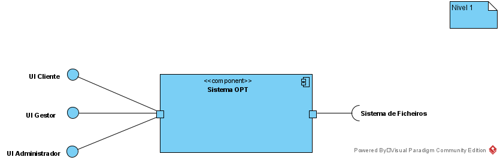
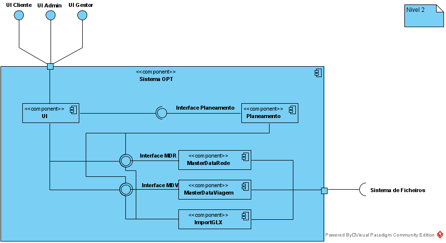
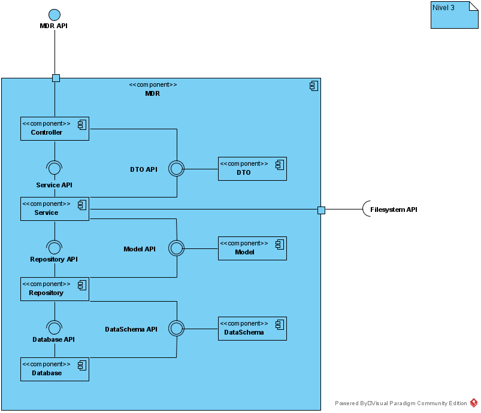

# Arquitetura
Nesta secção será apresentada informação sobre o modo como a aplicação foi estruturada.

## Arquitetura de sistema
Este projeto tem como objetivo implementar um sistema para a empresa OPT gerir as sua rede e serviço de transportes públicos. 

### Nível 1
De um modo mais alto nível apenas existirá o sistema OPT (implementado neste projeto) que terá 3 interfaces publicas (UI Cliente, UI Administrador, UI Administrador) e utilizará apenas uma a interface do sistema de ficheiros da máquina onde está a ser utilizado.

### Nível 2
Entrando um pouco mais em detalhe, o sistema OPT será constituído pelos serviços  
- UI: Interface que o utilizador final utilizará para aceder ao sistema OPT
- Planeamento: Camada responsável pelo planeamento
- Master Data Rede: Camada responsável por gerir as informações sobre a Rede
- Master Data Viagem: Camada responsável por gerir as informações sobre as Viagens
- ImportGLX: Camada responsável por ler as informações contidas num ficheiro .GLX e envia-la para o MasterData correspondente

### Nível 3 - Master Data rede
O Master Data Rede será construido seguindo uma arquitetura por camadas. Inicialmente o request chegado ao servidor será passado para o controller que passara a informação para a camada de Service através de um DTO. A camada Service, responsável por conhecer as regras de negocio, este DTO será processado e passado ao Repositório para ser persistido. Este processo dar-se-á por meio de um Model. O repositório por sua vez irá fazer o processo de persistência usando um DataScheema que neste caso tem como objetivo modelar a informação para ser armazenada numa base de dados MongoDB.

## Modelo de Domínio
A baixo é apresentado o modelo de domínio segundo a notação Domain Driven Design (DDD). Neste diagrama é possível observar as relações entres as diferentes entidades presentes no sistema OPT.
