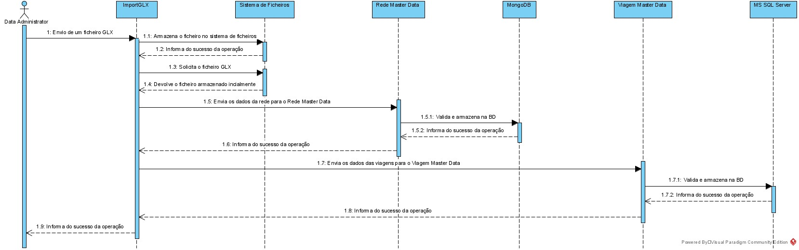
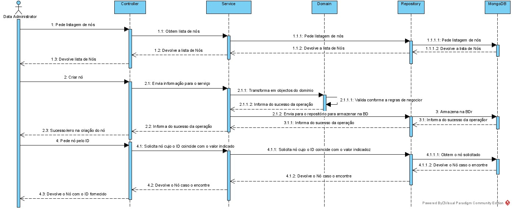
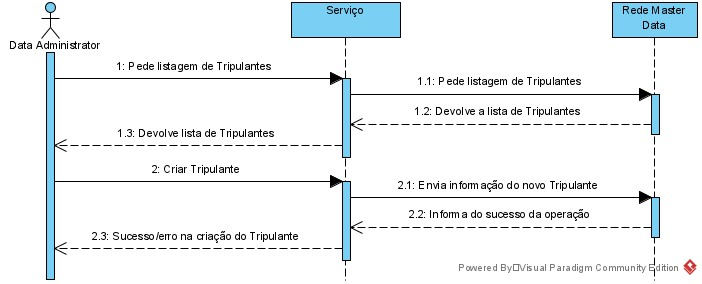

# Arquitetura
Nesta secção será apresentada informação sobre o modo como a aplicação foi estruturada.

## Introdução
Será adotada a combinação de dois modelos de representação arquitetural: C4 e 4+1.

O Modelo de Vistas 4+1 [Krutchen-1995] propõe a descrição do sistema através de vistas complementares permitindo assim analisar separadamente os requisitos dos vários stakeholders do software, tais como utilizadores, administradores de sistemas, project managers, arquitetos e programadores. As vistas são deste modo definidas da seguinte forma:

- Vista lógica: relativa aos aspetos do software visando responder aos desafios do negócio;
- Vista de processos: relativa ao fluxo de processos ou interações no sistema;
- Vista de desenvolvimento: relativa à organização do software no seu ambiente de desenvolvimento;
- Vista física: relativa ao mapeamento dos vários componentes do software em hardware, i.e. onde é executado o software;
- Vista de cenários: relativa à associação de processos de negócio com atores capazes de os espoletar.

O Modelo C4 [Brown-2020][C4-2020] defende a descrição do software através de quatro níveis de abstração: sistema, contentor, componente e código. Cada nível adota uma granularidade mais fina que o nível que o antecede, dando assim acesso a mais detalhe de uma parte mais pequena do sistema. Estes níveis podem ser equiparáveis a mapas, e.g. a vista de sistema corresponde ao globo, a vista de contentor corresponde ao mapa de cada continente, a vista de componentes ao mapa de cada país e a vista de código ao mapa de estradas e bairros de cada cidade. Diferentes níveis permitem contar histórias diferentes a audiências distintas.

Os níveis encontram-se definidos da seguinte forma:
- Nível 1: Descrição (enquadramento) do sistema como um todo;
- Nível 2: Descrição de contentores do sistema;
- Nível 3: Descrição de componentes dos contentores;
- Nível 4: Descrição do código ou partes mais pequenas dos componentes (e como tal, não será abordado nesta documentação).

Pode-se dizer que estes dois modelos se expandem ao longo de eixos distintos, sendo que o Modelo C4 apresenta o sistema com diferentes níveis de detalhe e o Modelo de Vista 4+1 apresenta o sistema de diferentes perspetivas. Ao combinar os dois modelos torna-se possível representar o sistema de diversas perspetivas, cada uma com vários níveis de detalhe.

Para modelar/representar visualmente, tanto o que foi implementado como as ideias e alternativas consideradas, recorre-se à Unified Modeling Language (UML) [UML-2020] [UMLDiagrams-2020].

## Modelo de Domínio
A baixo é apresentado o modelo de domínio segundo a notação Domain Driven Design (DDD). Este diagrama é utilizado para descrever as relações entres as diferentes entidades presentes no sistema OPT.

## Nível 1
De um modo mais alto nível apenas existirá o sistema OPT (implementado neste projeto) que terá 3 interfaces publicas (UI Cliente, UI Administrador, UI Administrador) e utilizará apenas uma a interface do sistema de ficheiros da máquina onde está a ser utilizado.
### Vista Lógica

### Vista de Processo
Importação de um ficheiro GLX

Listagem de todos os nós, criação de um nó, obter um nó por ID

## Nível 2
Entrando um pouco mais em detalhe, o sistema OPT será constituído pelos serviços  
- UI: Interface que o utilizador final utilizará para aceder ao sistema OPT
- Planeamento: Módulo responsável pelo planeamento
- Master Data Rede: Módulo responsável por gerir as informações sobre a Rede
- Master Data Viagem: Módulo responsável por gerir as informações sobre as Viagens
- ImportGLX: Módulo responsável por ler as informações contidas num ficheiro .GLX e envia-la para o MasterData correspondente

**Separação do Import GLX dos Master Data**
Para os dois Master Data existe um requísito de poder importar os dados de um ficheiro GLX. O grupo acabou por decidir que faria sentido separar esta funcionalidade numa aplicação à parte. As razões para esta separação:
- Isolamento de responsabilidades: Desta forma apenas 1 aplicação tem de saber ler de um ficheiro .GLX e aceder ao sistema de ficheiros, seja para ler ou escrever o ficheiro.
- Evitar código redundante: Desta forma a implementação do import GLX garante que não existiram dois sistemas com um propósito em comum.
- Reaproveitamento da interface já existente: Desta forma é possível reutilizar a interface HTTP já desenvolvida nas duas aplicações. Isto permite ainda que esta nova aplicação tenha apenas de saber mapear os valores do ficheiro GLX para o formato exigido pela interface HTTP, evitando que seja necessário implementar lógica de negocio para fazer validações.
- Isolamento de sistema de persistência: Desta forma cada aplicação tem acesso ao seu próprio sistema de persistência (RMD: MongoDB, VMD: MS SQL Server, ImportGLX: Sistema de Ficheiros). Isto ajudará a garantir que nenhuma das aplicações tentara aceder ao ficheiro importado antes que a outra termine de o processar.

Obviamente o grupo identifica ainda alguns pontos menos positivos, como:
- Uso mais intensivo da rede, visto a comunicação entre as aplicações se dar via HTTP. Neste caso o grupo não espera um impacto muito significativo na disponibilidade da aplicação pois esta é uma tarefa de manutenção que normalmente acontece num horário que o sistema tem um tráfego muito baixo ou ate que tem o tráfego desativado pelo próprio motivo da manutenção.
- Mais uma aplicação para manter: É verdade que se trata de uma aplicação extra para manter, mas devido à simplicidade do seu caso de uso, esta não deve ser uma tarefa muito complexa.

Apesar destes pontos, o grupo acredita que esta é a melhor forma de resolver o problema e implementou esta solução.

### Vista Lógica

### Vista de Processo
Importação da informação do ficheiro GLX

Criação de um nó

Criação de um tripulante

### Vista Implementação

### Vista Física

## Nível 3
### ImportGLX
O ImportGLX será construido seguindo uma arquitetura por camadas. Inicialmente o request chegado ao servidor será passado para o controller que passara a informação para a camada de Service. Esta passa ao repositório para armazenar o ficheiro no filesystem da aplicação. De seguida outro serviço é chamado para fazer o import para o Rede Master Data. Neste caso o repositório de filesystem é novamente invocado para obter o ficheiro gravado inicialmente. Este serviço então transforma esse ficheiro em objetos DTO e usa-os para os passar ao repositório Master Data que vai efetuar os pedidos HTTP ao sistema final 
#### Vista Lógica

#### Vista de Processo

#### Vista Implementação

### Master Data Rede
O Master Data Rede será construido seguindo uma arquitetura por camadas. Inicialmente o request chegado ao servidor será passado para o controller que passara a informação para a camada de Service através de um DTO. A camada Service, responsável por inicialmente enviar os dados para o Domínio cujo a responsabilidade é conhecer as regras de negocio e que vai validar o pedido. Após ser validado os dados são devolvidos ao service para serem enviado para o repositório. O repositório por sua vez irá fazer o processo de persistência usando um DataScheema que neste caso tem como objetivo modelar a informação para ser armazenada numa base de dados MongoDB.
#### Vista Lógica

#### Vista de Processo

#### Vista Implementação

### Viagem Data Viagem
O Master Data Viagem será construido seguindo uma arquitetura por camadas. Inicialmente o request chegado ao servidor será passado para o controller que passara a informação para a camada de Service através de um DTO. A camada Service, responsável por inicialmente enviar os dados para o Domínio cujo a responsabilidade é conhecer as regras de negocio e que vai validar o pedido. Após ser validado os dados são devolvidos ao service para serem enviado para o repositório. O repositório por sua vez irá fazer o processo de persistência usando um DataScheema que são uma representação do que existe no base de dados Microsoft SQL Server.
#### Vista Lógica

#### Vista de Processo

#### Vista Implementação

### Web UI
O Master Data Viagem será construido seguindo uma arquitetura por camadas semelhante às aplicações anteriores mas com uma estrutura um pouco mais simples. Inicialmente o utilizador seleciona o módulo que pretende visualizar. Será invocado um serviço para que seja feito um pedido ao módulo responsável. A reposta será então mapeada para um model que será utilizado para apresentar a informação ao cliente.
#### Vista Lógica

#### Vista de Processo
Listagem de nós e criação de um nó

Listagem de tripulantes e criação de um tripulante

#### Vista Implementação
