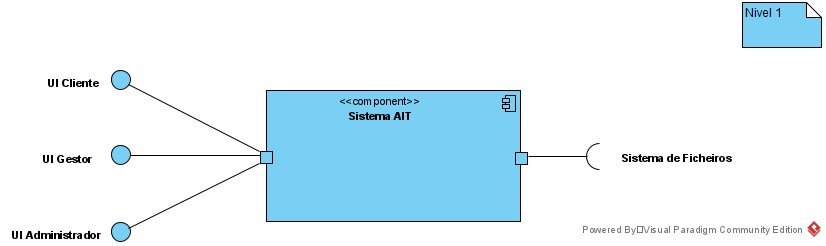
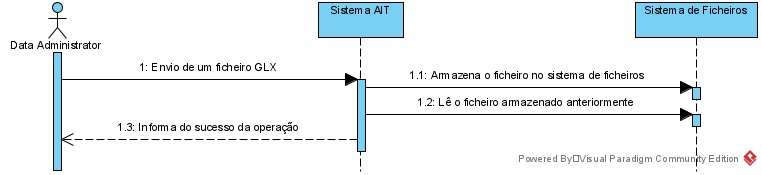
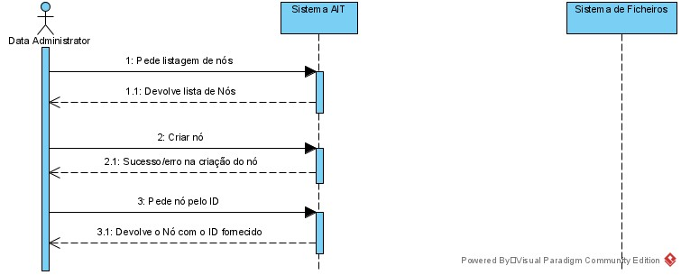

## Nível 1
De um modo mais alto nível apenas existirá o sistema OPT (implementado neste projeto) que terá 3 interfaces publicas (UI Cliente, UI Administrador, UI Administrador) e utilizará apenas uma a interface do sistema de ficheiros da máquina onde está a ser utilizado.
### Vista Lógica

### Vista de Processo
Importação de um ficheiro GLX

Listagem de todos os nós, criação de um nó, obter um nó por ID
