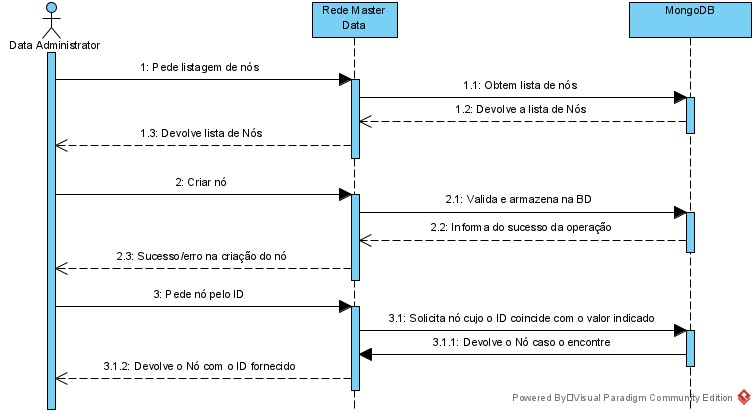
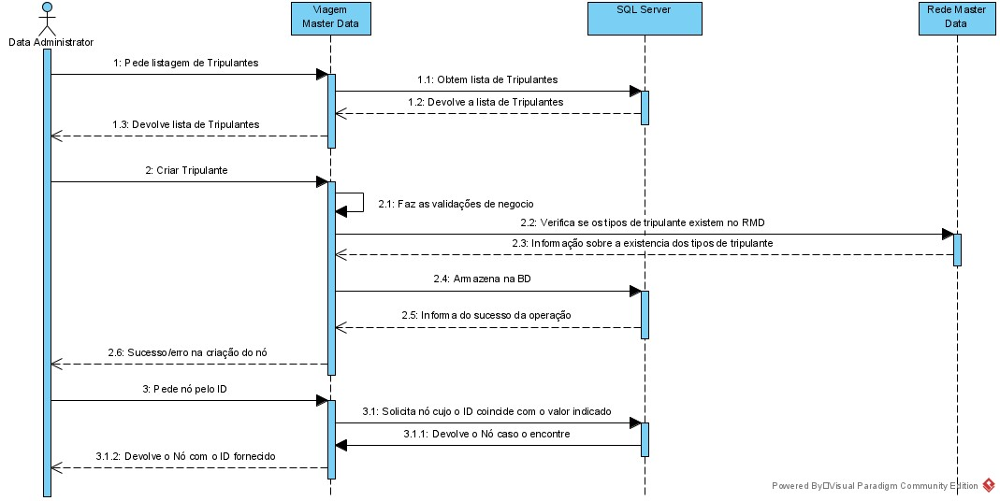
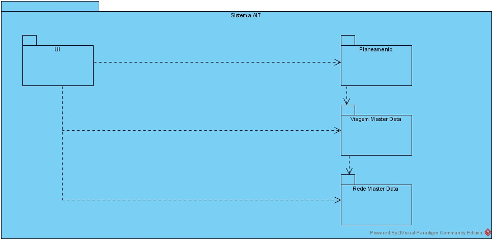

## Nível 2
Entrando um pouco mais em detalhe, o sistema OPT será constituído pelos serviços  
- UI: Interface que o utilizador final utilizará para aceder ao sistema OPT
- Planeamento: Módulo responsável pelo planeamento
- Master Data Rede: Módulo responsável por gerir as informações sobre a Rede
- Master Data Viagem: Módulo responsável por gerir as informações sobre as Viagens
- ImportGLX: Módulo responsável por ler as informações contidas num ficheiro .GLX e envia-la para o MasterData correspondente

**Separação do Import GLX dos Master Data**
Para os dois Master Data existe um requísito de poder importar os dados de um ficheiro GLX. O grupo acabou por decidir que faria sentido separar esta funcionalidade numa aplicação à parte. As razões para esta separação:
- Isolamento de responsabilidades: Desta forma apenas 1 aplicação tem de saber ler de um ficheiro .GLX e aceder ao sistema de ficheiros, seja para ler ou escrever o ficheiro.
- Evitar código redundante: Desta forma a implementação do import GLX garante que não existiram dois sistemas com um propósito em comum.
- Reaproveitamento da interface já existente: Desta forma é possível reutilizar a interface HTTP já desenvolvida nas duas aplicações. Isto permite ainda que esta nova aplicação tenha apenas de saber mapear os valores do ficheiro GLX para o formato exigido pela interface HTTP, evitando que seja necessário implementar lógica de negocio para fazer validações.
- Isolamento de sistema de persistência: Desta forma cada aplicação tem acesso ao seu próprio sistema de persistência (RMD: MongoDB, VMD: MS SQL Server, ImportGLX: Sistema de Ficheiros). Isto ajudará a garantir que nenhuma das aplicações tentara aceder ao ficheiro importado antes que a outra termine de o processar.

Obviamente o grupo identifica ainda alguns pontos menos positivos, como:
- Uso mais intensivo da rede, visto a comunicação entre as aplicações se dar via HTTP. Neste caso o grupo não espera um impacto muito significativo na disponibilidade da aplicação pois esta é uma tarefa de manutenção que normalmente acontece num horário que o sistema tem um tráfego muito baixo ou ate que tem o tráfego desativado pelo próprio motivo da manutenção.
- Mais uma aplicação para manter: É verdade que se trata de uma aplicação extra para manter, mas devido à simplicidade do seu caso de uso, esta não deve ser uma tarefa muito complexa.

Apesar destes pontos, o grupo acredita que esta é a melhor forma de resolver o problema e implementou esta solução.

### Vista Lógica

### Vista de Processo
Importação da informação do ficheiro GLX

Criação de um nó

Criação de um tripulante

### Vista Implementação

### Vista Física

