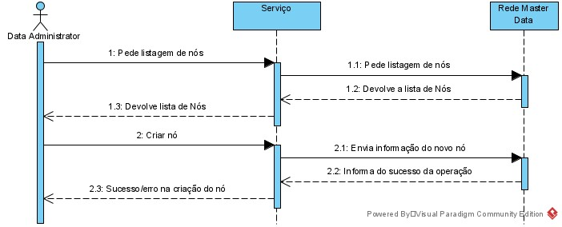

## Nível 3 - Web UI
O Master Data Viagem será construido seguindo uma arquitetura por camadas semelhante às aplicações anteriores mas com uma estrutura um pouco mais simples. Inicialmente o utilizador seleciona o módulo que pretende visualizar. Será invocado um serviço para que seja feito um pedido ao módulo responsável. A reposta será então mapeada para um model que será utilizado para apresentar a informação ao cliente.
#### Vista Lógica

#### Vista de Processo
Listagem de nós e criação de um nó

Listagem de tripulantes e criação de um tripulante

#### Vista Implementação
