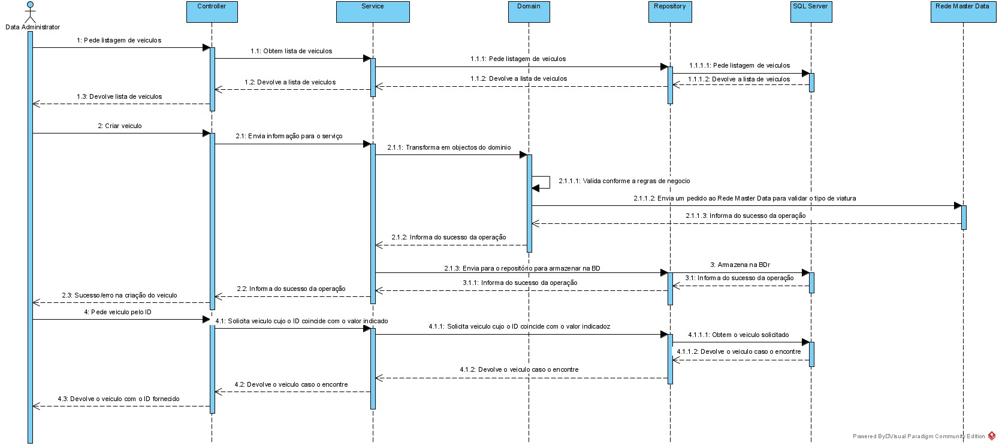

## Nível 3 - Viagem Data Viagem
O Master Data Viagem será construido seguindo uma arquitetura por camadas. Inicialmente o request chegado ao servidor será passado para o controller que passara a informação para a camada de Service através de um DTO. A camada Service, responsável por inicialmente enviar os dados para o Domínio cujo a responsabilidade é conhecer as regras de negocio e que vai validar o pedido. Após ser validado os dados são devolvidos ao service para serem enviado para o repositório. O repositório por sua vez irá fazer o processo de persistência usando um DataScheema que são uma representação do que existe no base de dados Microsoft SQL Server.
#### Vista Lógica

#### Vista de Processo

#### Vista Implementação
