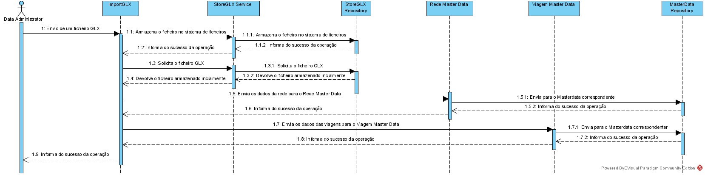
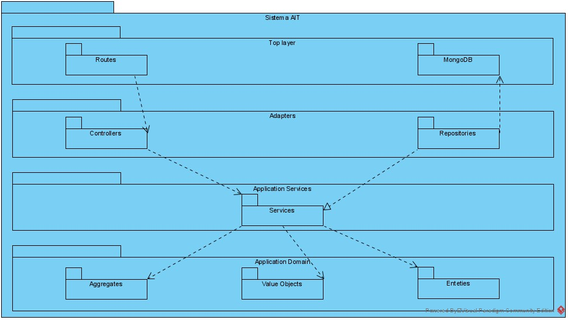
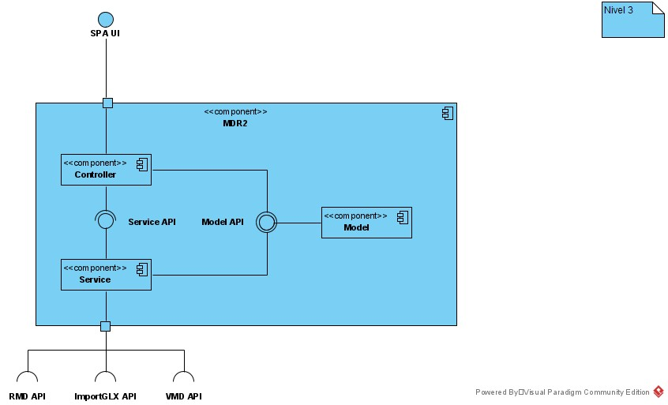

## Nível 3
### ImportGLX
O ImportGLX será construido seguindo uma arquitetura por camadas. Inicialmente o request chegado ao servidor será passado para o controller que passara a informação para a camada de Service. Esta passa ao repositório para armazenar o ficheiro no filesystem da aplicação. De seguida outro serviço é chamado para fazer o import para o Rede Master Data. Neste caso o repositório de filesystem é novamente invocado para obter o ficheiro gravado inicialmente. Este serviço então transforma esse ficheiro em objetos DTO e usa-os para os passar ao repositório Master Data que vai efetuar os pedidos HTTP ao sistema final 
#### Vista Lógica

#### Vista de Processo

#### Vista Implementação

### Master Data Rede
O Master Data Rede será construido seguindo uma arquitetura por camadas. Inicialmente o request chegado ao servidor será passado para o controller que passara a informação para a camada de Service através de um DTO. A camada Service, responsável por inicialmente enviar os dados para o Domínio cujo a responsabilidade é conhecer as regras de negocio e que vai validar o pedido. Após ser validado os dados são devolvidos ao service para serem enviado para o repositório. O repositório por sua vez irá fazer o processo de persistência usando um DataScheema que neste caso tem como objetivo modelar a informação para ser armazenada numa base de dados MongoDB.
#### Vista Lógica

#### Vista de Processo

#### Vista Implementação

### Viagem Data Viagem
O Master Data Viagem será construido seguindo uma arquitetura por camadas. Inicialmente o request chegado ao servidor será passado para o controller que passara a informação para a camada de Service através de um DTO. A camada Service, responsável por inicialmente enviar os dados para o Domínio cujo a responsabilidade é conhecer as regras de negocio e que vai validar o pedido. Após ser validado os dados são devolvidos ao service para serem enviado para o repositório. O repositório por sua vez irá fazer o processo de persistência usando um DataScheema que são uma representação do que existe no base de dados Microsoft SQL Server.
#### Vista Lógica

#### Vista de Processo

#### Vista Implementação

### Web UI
O Master Data Viagem será construido seguindo uma arquitetura por camadas semelhante às aplicações anteriores mas com uma estrutura um pouco mais simples. Inicialmente o utilizador seleciona o módulo que pretende visualizar. Será invocado um serviço para que seja feito um pedido ao módulo responsável. A reposta será então mapeada para um model que será utilizado para apresentar a informação ao cliente.
#### Vista Lógica

#### Vista de Processo
Listagem de nós e criação de um nó

Listagem de tripulantes e criação de um tripulante

#### Vista Implementação
